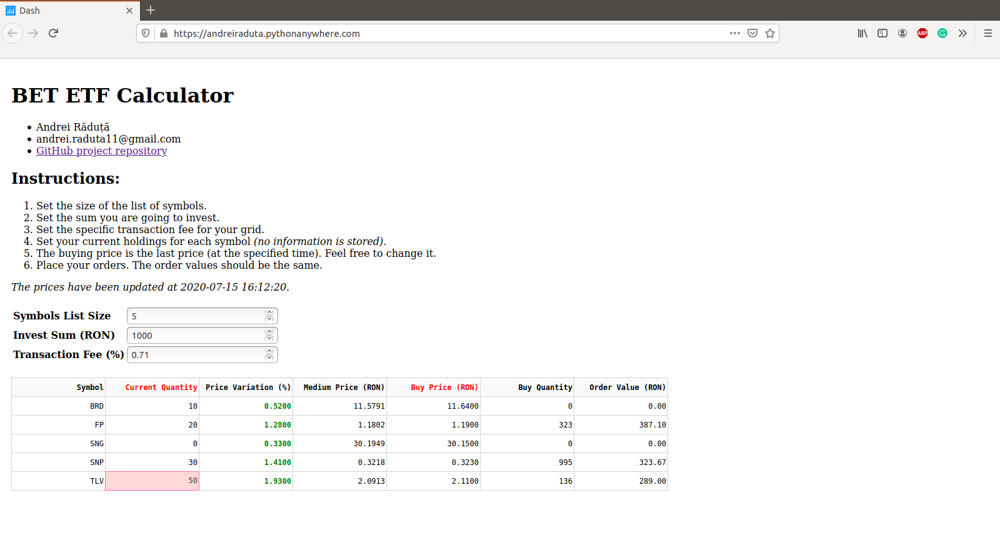

# bet-etf

The purpose of this repository is to help investors better copy the BET Index (ie. the behavior of the Romanian stock market). It consists of a transaction order calculator, so each investor can build its BET Index Exchange-Traded Fund.

# Design

There are 2 main components:

1.  `Collector` - module that fetch symbols list and details from the web.
    The sources of the information are the Bucharest Stock Exchange and the Tradeville broker websites.

2.  `Dash Application` - module with which the user will interact.
    This contains the Dash and HTML components and also the callback function that updates the content of the page at every change that user has made.

The Docker versions also contain other components like Grafana Dashboard and MySQL database.

# Implementation

The project has the following implementations:

1.  `PythonAnywhere` - <https://andreiraduta.pythonanywhere.com>
2.  `Docker Compose` - simple Docker application.
3.  `Docker Swarm` - built to deploy a stack of services on a swarm.

# Usage

The instructions can be found on the website page. It looks like this:

